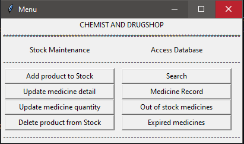
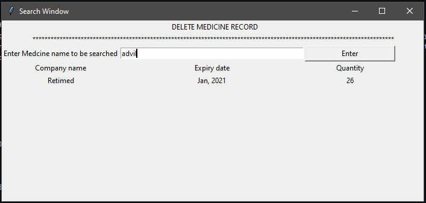
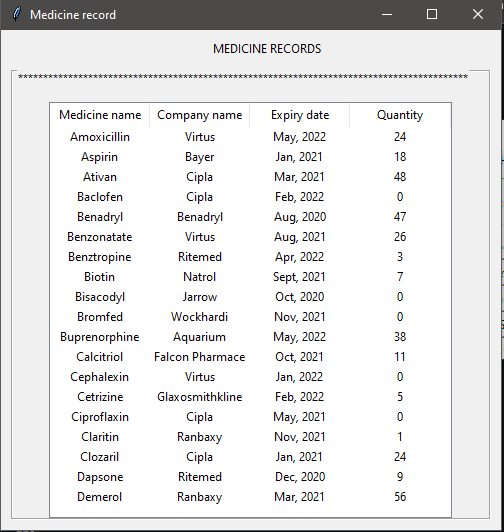
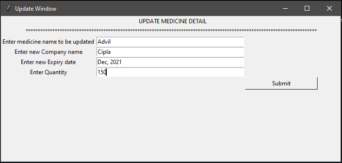

# Pharmacy Management System
A GUI based program for a pharmacy, to store and manipulate medicine data.

## Contents

- [Overview](#overview)
- [Screen Captures](#screen-captures)
  - [Home Page](#home-page)
  - [Search Page](#search-page)
  - [Display of entire Medicine stock](#display-of-entire-medicine-stock)
  - [Update Page](#update-page)
- [Features](#features)
- [Dependencies](#dependencies)
- [Setup](#setup)

## Overview

This is a GUI based application build for usage at a pharmacy, to store the records of medicines at the store. Python was used to program the application and Tkinter for creating the graphical user interface. The medicine records are stored in a `.csv` file but during the runtime of application all the information from the file is used to create a ternary search tree and data access using the tree becomes much faster.

## Screen Captures

Screen captures of the application showing some of its functionalities:

### Home Page



### Search Page

User can search on this page for a medicine in the database. Its details are shown if it is present otherwise a message saying no such medicine exists is displayed. <br>


### Display of entire Medicine stock

The details of entire medicine stock in the database is displayed in this window


### Update Page

To update details of an existing medicine, like quantitiy in stock. If no such medicine present in the database, a message saying the same is displayed. <br>


## Features

- User friendly interface.
- Displays out of stock medicines.
- Displays list of expired medicines.
- Fast operations (addition, deletion, accessing) because of usage of efficient dataset.

## Dependencies

- `python == 3.8.2`
- `tkinter`

## Setup

- The system should have [python](https://www.python.org/downloads/) installed on it.
- Clone the repository on your device.
- Fullfill the requirements by installing the dependencies.
```sh
pip install tk
```
- Make sure the `.csv` file and `.py` file are in the same directory everytime the application is run.
